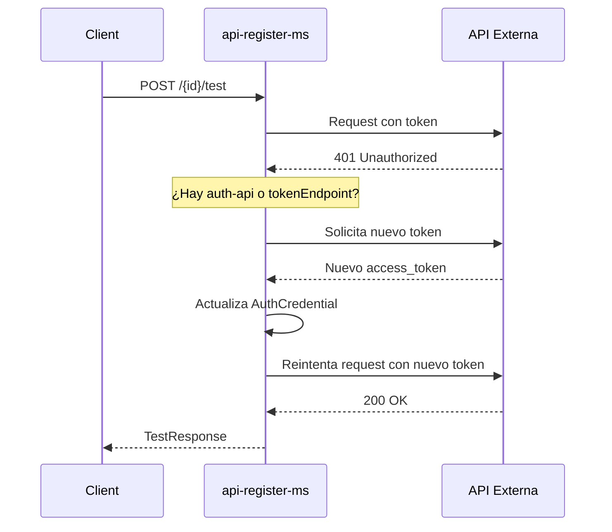

# API Registry — Documentación del Microservicio

## Propósito

Microservicio para el **registro y gestión de APIs externas**. Cada API registrada puede incluir su configuración de método HTTP, URL, parámetros, body y autenticación. Sirve como catálogo central de APIs utilizado por el `integration-ms` para validar y configurar integraciones ETL.

---

## Entidades

### Modelo de datos

```mermaid
erDiagram
    Apis ||--o{ ApiEndpoint : "hereda"
    Apis ||--o| AuthConfig : tiene
    AuthConfig ||--o| AuthCredential : tiene
    AuthConfig ||--o| Header : referencia
    Apis ||--o| Method : usa (GET, POST, etc.)
    Apis ||--o| Apis : "auth_api (self-ref)"
```

### Apis (base)

| Campo       | Tipo            | Descripción                                            |
|-------------|-----------------|--------------------------------------------------------|
| id          | Long            | ID autoincremental                                     |
| method      | Method (FK)     | Método HTTP (GET, POST, PUT, DELETE, etc.)             |
| url         | String          | URL base de la API                                     |
| description | String          | Descripción de la API                                  |
| createdAt   | LocalDateTime   | Fecha de registro                                      |
| authConfig  | AuthConfig (1:1)| Configuración de autenticación (opcional)              |
| authApi     | Apis (self-ref) | API de autenticación secundaria para refresh de token  |

### ApiEndpoint (hereda de Apis)

| Campo       | Tipo   | Descripción                                  |
|-------------|--------|----------------------------------------------|
| pathParams  | String | Parámetros de path (ej. `/users/{id}`)       |
| queryParams | String | Parámetros query string (ej. `?page=1`)      |
| body        | Text   | Cuerpo de la petición (JSON/texto)           |

### Method

| Campo | Tipo   | Descripción                     |
|-------|--------|---------------------------------|
| id    | Long   | ID autoincremental              |
| name  | String | Nombre del método (GET, POST…)  |

### AuthConfig

| Campo           | Tipo            | Descripción                                   |
|-----------------|-----------------|-----------------------------------------------|
| id              | Long            | ID autoincremental                            |
| api             | Apis (FK)       | API asociada                                  |
| authType        | AuthType        | Tipo de autenticación                         |
| header          | Header (FK)     | Header HTTP para la autenticación             |
| authCredential  | AuthCredential  | Valor del credential/token                    |
| username        | String          | Usuario para Basic Auth / OAuth2              |
| password        | String          | Contraseña para Basic Auth / OAuth2           |
| tokenEndpoint   | String          | Endpoint OAuth2 para refresh de token         |
| tokenExpiry     | LocalDateTime   | Expiración del token                          |
| createdAt       | LocalDateTime   | Fecha de creación                             |

### AuthCredential

| Campo           | Tipo            | Descripción                    |
|-----------------|-----------------|--------------------------------|
| id              | Long            | ID autoincremental             |
| credentialValue | Text            | Token o API key en texto       |
| createdAt       | LocalDateTime   | Fecha de creación              |
| updatedAt       | LocalDateTime   | Fecha de actualización         |

### Header

| Campo | Tipo   | Descripción                              |
|-------|--------|------------------------------------------|
| id    | Long   | ID autoincremental                       |
| value | String | Nombre del header (ej. `Authorization`)  |

### AuthType

| Valor   | Descripción                                         |
|---------|-----------------------------------------------------|
| NONE    | Sin autenticación                                   |
| BASIC   | Basic Auth (username:password en Base64)            |
| BEARER  | Bearer Token                                        |
| API_KEY| API Key en header personalizado                     |
| OAUTH2  | OAuth 2.0 Client Credentials (con refresh automático) |

---

## Endpoints

**Base URL:** `/api-registry`

### `POST /api-registry`
Registra una nueva API.

**Request Body:**
```json
{
  "method": "GET",
  "url": "https://api.example.com/users",
  "description": "Obtener lista de usuarios",
  "pathParams": "",
  "queryParams": "page=1&limit=10",
  "authType": "BEARER",
  "authHeader": "Authorization",
  "authValue": "token123",
  "username": "user",
  "password": "pass",
  "tokenEndpoint": "https://api.example.com/oauth/token",
  "headers": {
    "Content-Type": "application/json"
  },
  "body": "{\"key\": \"value\"}",
  "apiAuth": null
}
```

| Campo         | Tipo                      | Obligatorio | Descripción                                    |
|---------------|---------------------------|-------------|------------------------------------------------|
| method        | String                    | Sí          | GET, POST, PUT, DELETE, etc.                   |
| url           | String                    | Sí          | URL base del endpoint                          |
| description   | String                    | No          | Descripción                                    |
| pathParams    | String                    | No          | Parámetros de ruta                             |
| queryParams   | String                    | No          | Parámetros query                               |
| body          | String                    | No          | Cuerpo de la petición                          |
| authType      | AuthType                  | No          | Tipo de autenticación                          |
| authHeader    | String                    | No          | Header para auth (default: `Authorization`)   |
| authValue     | String                    | No          | Token o API key                                |
| username      | String                    | No          | Para BASIC / OAUTH2                            |
| password      | String                    | No          | Para BASIC / OAUTH2                            |
| tokenEndpoint | String                    | No          | Endpoint OAuth2 para refresh                   |
| apiAuth       | ApiRegisterRequest (anidado)| No        | API de autenticación secundaria                |

**Response:** `ApiResponse`

> **Nota:** El campo `apiAuth` permite registrar una API **hermana** encargada de generar tokens de autenticación (auth API). Si se define, el sistema llamará a esta API automáticamente para refrescar tokens expirados.

### `GET /api-registry/{id}`
Obtiene una API por ID. También ejecuta la request almacenada (efecto secundario).

**Response:** `ApiResponse`

### `GET /api-registry/list`
Lista todas las APIs registradas.

**Response:** `ApiResponse[]`

### `GET /api-registry/{id}/auth-api`
Obtiene los datos de la API de autenticación asociada.

**Response:** `ApiResponse`

### `POST /api-registry/{id}/test`
Prueba la ejecución de una API contra el endpoint real.

**Request Body** (opcional — si no se envía, usa los valores registrados):
```json
{
  "pathParams": "/123",
  "queryParams": "name=test",
  "body": "{\"test\": \"data\"}"
}
```

**Response:**
```json
{
  "statusCode": 200,
  "body": "{\"id\": 123, \"name\": \"test\"}",
  "headers": {
    "content-type": "application/json"
  },
  "responseTimeMs": 450,
  "timestamp": "2026-05-14T12:00:00",
  "error": null
}
```

**Comportamiento:**
- Ejecuta la request real contra la URL configurada
- Resuelve headers de autenticación (Bearer, Basic, API Key, OAuth2)
- Si recibe `401` y hay una auth-api configurada → refresca el token automáticamente y reintenta
- Timeout: 30 segundos

### `PUT /api-registry/{id}`
Actualiza los datos de una API existente (excepto auth-api).

**Request Body:** `ApiUpdateRequest`

**Response:** `ApiResponse`

### `PUT /api-registry/{id}/auth-api`
Actualiza específicamente la API de autenticación asociada.

**Request Body:** `ApiUpdateRequest`

**Response:** `ApiResponse` (de la auth-api, no de la API principal)

---

## DTOs

### ApiUpdateRequest
```json
{
  "method": "GET",
  "url": "https://api.example.com/users",
  "description": "Actualizar descripción",
  "pathParams": "",
  "queryParams": "page=1",
  "body": "{\"key\": \"value\"}",
  "authType": "BEARER",
  "authHeader": "Authorization",
  "authValue": "Bearer token456",
  "username": "user",
  "password": "pass",
  "tokenEndpoint": "https://api.example.com/oauth/token"
}
```

### ApiResponse
```json
{
  "id": 1,
  "method": "GET",
  "url": "https://api.example.com/users",
  "description": "Obtener lista de usuarios",
  "pathParams": "",
  "queryParams": "page=1&limit=10",
  "body": "{\"key\": \"value\"}",
  "createdAt": "2026-05-14T10:00:00",
  "authType": "BEARER",
  "authHeader": "Authorization",
  "authApiId": 2,
  "authApiUrl": "https://api.example.com/oauth/token",
  "authValue": "token123"
}
```

---

## Flujo de Autenticación

### Resolución de headers

| AuthType  | Header generado                                   |
|-----------|---------------------------------------------------|
| NONE      | Sin header                                        |
| BASIC     | `Authorization: Basic base64(user:pass)`          |
| BEARER    | `Authorization: Bearer {token}`                   |
| API_KEY   | `{authHeader}: {authValue}`                       |
| OAUTH2    | `Authorization: Bearer {token}`                   |

### Refresh automático de token



El refresh se dispara automáticamente cuando:
1. La API tiene una **auth-api** configurada (API hermana que genera tokens)
2. La API tiene configurado **tokenEndpoint + username + password** (OAuth2 Client Credentials)

---

## Reglas de Negocio

| Regla | Comportamiento |
|-------|---------------|
| **Herencia JOINED** | `ApiEndpoint` extiende `Apis` con estrategia JOINED (tabla separada para pathParams, queryParams, body) |
| **Auth API anidada** | Una API puede tener una `authApi` que es otra instancia de `Apis`, usada para refresh automático de tokens |
| **Refresh automático** | Si al probar (`/test`) se obtiene 401 y hay auth-api configurada, se refresca el token y se reintenta una vez |
| **Timeout** | Todas las requests externas tienen timeout de 30 segundos |
| **Métodos HTTP** | Los métodos se almacenan en tabla aparte `http_methods` y se reutilizan (GET, POST, etc.) |

---

## Integración con otros servicios

| Servicio | Consumidor | Uso |
|----------|-----------|-----|
| integration-ms | api-register-ms | Valida que los IDs de API existan al crear integraciones (`GET /api-registry/{id}`) |
| schema-matching-ms | api-register-ms | No consume directamente, pero references a APIs via integration-ms |

---

## Códigos de Error

| HTTP | Causa |
|------|-------|
| 400  | Validación de DTO falla |
| 404  | API no encontrada |
| 500  | Error interno o timeout en request externa |
