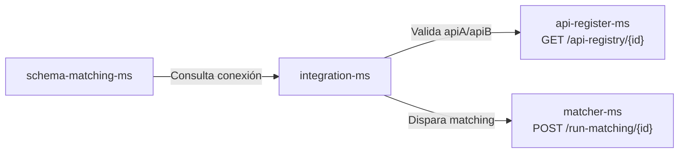
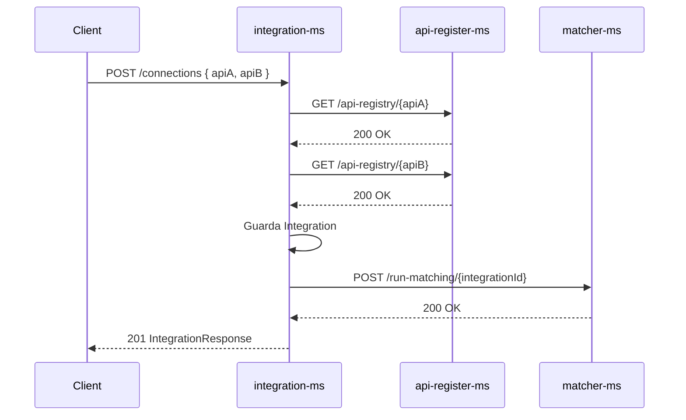

# Integration MS — Documentación del Microservicio

## Propósito

Microservicio central para la gestión de **integraciones** (conexiones) entre pares de APIs. Una integración representa un vínculo entre una API origen (`apiA`) y una API destino (`apiB`). Al crearla, dispara automáticamente el proceso de matching vía el **MATCHER-MS** para generar los `SchemaMatch` correspondientes.

---

## Entidades

### Integration

| Campo       | Tipo            | Descripción                                            |
|-------------|-----------------|--------------------------------------------------------|
| id          | Long            | ID autoincremental                                     |
| apiA        | String          | ID o URL de la API origen (referencia a api-register)  |
| apiB        | String          | ID o URL de la API destino (referencia a api-register) |
| description | String          | Descripción opcional de la integración                 |
| status      | IntegrationStatus | `ACTIVE` / `DELETED`                                 |
| createdAt   | LocalDateTime   | Fecha de creación                                      |
| updatedAt   | LocalDateTime   | Fecha de última modificación                           |

### IntegrationStatus

| Valor   | Significado             |
|---------|-------------------------|
| ACTIVE  | Integración activa      |
| DELETED | Integración eliminada (soft delete) |

---

## Endpoints

**Base URL:** `/api/integrations`

### `POST /api/integrations/connections`
Crea una nueva integración.

**Request Body:**
```json
{
  "apiA": "1",
  "apiB": "2",
  "description": "Mapping between Alpha and Beta APIs"
}
```

| Campo       | Tipo   | Obligatorio | Descripción                                |
|-------------|--------|-------------|--------------------------------------------|
| apiA        | String | Sí          | ID de la API origen en api-register-ms     |
| apiB        | String | Sí          | ID de la API destino en api-register-ms    |
| description | String | No          | Descripción de la integración              |

**Validaciones:**
- `apiA` y `apiB` deben existir en **api-register-ms** (se valida contra `GET /api-registry/{id}`)
- Si algún ID es inválido → error 400

**Efectos secundarios:**
- Dispara automáticamente el **MATCHER-MS**: `POST /run-matching/{integrationId}`

**Response:** `IntegrationResponse` (status 201)

### `GET /api/integrations/connections`
Lista todas las integraciones activas (excluye `DELETED`).

**Response:** `IntegrationResponse[]`

### `GET /api/integrations/connections/all`
Lista todas las integraciones **incluyendo** las eliminadas.

**Response:** `IntegrationResponse[]`

### `GET /api/integrations/connections/{id}`
Obtiene una integración por ID.

**Response:** `IntegrationResponse`

### `POST /api/integrations/connections/{id}`
Actualiza una integración.

**Request Body:** `IntegrationRequest`

**Validaciones:** Misma validación de `apiA` y `apiB` contra api-register-ms.

**Response:** `IntegrationResponse`

### `PATCH /api/integrations/connections/{id}/status`
Actualiza el estado de una integración.

**Request Body:** `IntegrationStatus` (raw string: `"ACTIVE"` o `"DELETED"`)

**Response:** `IntegrationResponse`

### `DELETE /api/integrations/connections/{id}`
Elimina una integración (soft delete: `status → DELETED`).

**Response:** 204 No Content

---

## DTOs

### IntegrationRequest
```json
{
  "apiA": "1",
  "apiB": "2",
  "description": "Mapping between Alpha and Beta APIs"
}
```

### IntegrationResponse
```json
{
  "id": 1,
  "apiA": "1",
  "apiB": "2",
  "description": "Mapping between Alpha and Beta APIs",
  "status": "ACTIVE",
  "createdAt": "2026-05-14T10:00:00",
  "updatedAt": "2026-05-14T10:00:00"
}
```

---

## Reglas de Negocio

| Regla | Comportamiento |
|-------|---------------|
| **Validación de APIs** | Al crear/actualizar, valida que `apiA` y `apiB` existan en api-register-ms (`GET /api-registry/{id}`). Si no existen → error 400 |
| **Matching automático** | Al crear una integración, llama automáticamente al MATCHER-MS para generar los SchemaMatch |
| **Soft delete** | `DELETE` no borra el registro, solo cambia `status → DELETED`. Los listados por defecto excluyen eliminados |
| **APIs duplicadas** | No hay restricción de duplicados; se pueden crear múltiples integraciones con el mismo par de APIs |

---

## Integración con otros servicios



### Flujo de creación



---

## Códigos de Error

| HTTP | Causa |
|------|-------|
| 400  | apiA o apiB inválidos (no existen en api-register-ms) |
| 404  | Integración no encontrada |
| 500  | Error interno o fallo en conexión con matcher-ms |
