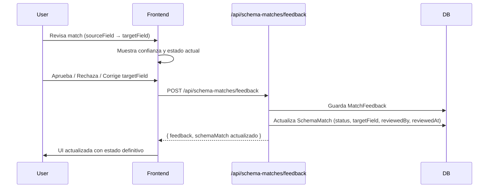

# Match Feedback — Lógica para Frontend

## Propósito

El feedback del usuario sobre los `SchemaMatch` generados automáticamente sirve para:

1. **Corregir** matches incorrectos (el usuario indica el target real).
2. **Aceptar** matches correctos y marcarlos como revisados.
3. **Entrenar** el modelo de matching a futuro usando los pares (source → actualTarget) como ground truth.

---

## Flujo de Feedback



---

## Endpoint

### `POST /api/schema-matches/feedback`

**Request Body:**

```json
{
  "matchId": 1,
  "userApproved": true,
  "actualTarget": "nombre_completo",
  "reviewedBy": 42
}
```

| Campo         | Tipo     | Obligatorio | Descripción                                           |
|---------------|----------|-------------|-------------------------------------------------------|
| `matchId`     | Long     | Sí          | ID del SchemaMatch a revisar                          |
| `userApproved`| Boolean  | Sí          | `true` = aceptado, `false` = rechazado                |
| `actualTarget`| String   | No          | Target corregido (obligatorio si userApproved=false)  |
| `reviewedBy`  | Long     | Sí          | ID del usuario que revisa                             |

**Response:**

```json
{
  "feedback": {
    "id": 10,
    "matchId": 1,
    "userApproved": true,
    "actualTarget": "nombre_completo",
    "createdAt": "2026-05-14T12:00:00"
  },
  "schemaMatch": {
    "id": 1,
    "integrationId": 5,
    "sourceField": "full_name",
    "targetField": "nombre_completo",
    "confidence": 0.8500,
    "status": "ACCEPTED",
    "transformation": null,
    "reviewedBy": 42,
    "reviewedAt": "2026-05-14T12:00:00",
    "createdAt": "2026-05-14T10:00:00"
  }
}
```

---

## Comportamiento Backend (al enviar feedback)

| Condición                              | Actualización en SchemaMatch                      |
|----------------------------------------|---------------------------------------------------|
| `userApproved = true`                  | `status → ACCEPTED`, `targetField` se mantiene    |
| `userApproved = false`                 | `status → REJECTED`                               |
| `actualTarget` presente y no vacío     | `targetField → actualTarget`                      |
| Siempre                                | `reviewedBy → reviewedBy`, `reviewedAt → now()`   |

---

## Implementación Frontend (React / TypeScript)

### 1. Hook o función de servicio

```typescript
// services/schemaMatchService.ts

export interface FeedbackRequest {
  matchId: number;
  userApproved: boolean;
  actualTarget?: string;
  reviewedBy: number;
}

export interface FeedbackResponse {
  feedback: {
    id: number;
    matchId: number;
    userApproved: boolean;
    actualTarget: string | null;
    createdAt: string;
  };
  schemaMatch: SchemaMatch;
}

export async function submitFeedback(data: FeedbackRequest): Promise<FeedbackResponse> {
  const res = await fetch('/api/schema-matches/feedback', {
    method: 'POST',
    headers: { 'Content-Type': 'application/json' },
    body: JSON.stringify(data),
  });
  if (!res.ok) throw new Error('Error al enviar feedback');
  return res.json();
}
```

### 2. Componente de revisión de match

```tsx
// components/MatchReviewCard.tsx

interface Props {
  match: SchemaMatch;
  userId: number;
  onReviewed: (updated: SchemaMatch) => void;
}

function MatchReviewCard({ match, userId, onReviewed }: Props) {
  const [actualTarget, setActualTarget] = useState(match.targetField);
  const [submitting, setSubmitting] = useState(false);

  const handleApprove = async () => {
    setSubmitting(true);
    const result = await submitFeedback({
      matchId: match.id,
      userApproved: true,
      actualTarget: match.targetField, // envía el target original como ground truth
      reviewedBy: userId,
    });
    onReviewed(result.schemaMatch);
    setSubmitting(false);
  };

  const handleRejectWithCorrection = async () => {
    if (!actualTarget.trim()) return;
    setSubmitting(true);
    const result = await submitFeedback({
      matchId: match.id,
      userApproved: false,
      actualTarget: actualTarget.trim(),
      reviewedBy: userId,
    });
    onReviewed(result.schemaMatch);
    setSubmitting(false);
  };

  if (match.status !== 'PENDING') {
    // Match ya revisado — mostrar modo solo lectura
    return <MatchReviewCardReadOnly match={match} />;
  }

  return (
    <div className="match-review-card">
      <div className="fields">
        <span className="source">{match.sourceField}</span>
        <span className="arrow">→</span>
        <input
          value={actualTarget}
          onChange={(e) => setActualTarget(e.target.value)}
          disabled={submitting}
        />
      </div>
      <div className="confidence">
        Confianza: {(match.confidence * 100).toFixed(1)}%
      </div>
      <div className="actions">
        <button onClick={handleApprove} disabled={submitting}>
          ✓ Aceptar
        </button>
        <button
          onClick={handleRejectWithCorrection}
          disabled={submitting || !actualTarget.trim()}
        >
          ✗ Rechazar con corrección
        </button>
      </div>
    </div>
  );
}
```

### 3. Estados de UI

| Estado del Match | Acción del usuario           | UI después del feedback                          |
|------------------|------------------------------|--------------------------------------------------|
| `PENDING`        | Aceptar                      | Match se marca como `ACCEPTED`, readonly         |
| `PENDING`        | Rechazar + corregir target   | Match se marca como `REJECTED`, readonly         |
| `PENDING`        | Rechazar + mismo target      | Match se marca como `REJECTED`, readonly         |
| `ACCEPTED`       | — (ya revisado)              | Badge verde "Aceptado", readonly                 |
| `REJECTED`       | — (ya revisado)              | Badge rojo "Rechazado", readonly                 |

---

## Obtención de matches con feedback

Para mostrar todos los matches de una integración con su feedback:

### `GET /api/schema-matches/integration/{integrationId}`

Cada `SchemaMatch` incluye su `status` actualizado tras el feedback.

### `GET /api/schema-matches/{id}/feedback`

Devuelve el historial de feedbacks para un match específico.

---

## Lógica de entrenamiento (para futuro modelo ML)

Cada `MatchFeedback` aprobado (con o sin corrección) se considera **ground truth**:

```sql
-- Consulta para exportar dataset de entrenamiento
SELECT
  sm.source_field,
  COALESCE(mf.actual_target, sm.target_field) AS correct_target,
  sm.confidence AS original_confidence,
  mf.user_approved,
  mf.created_at AS feedback_date
FROM schema_match sm
JOIN match_feedback mf ON mf.match_id = sm.id
WHERE mf.user_approved IS NOT NULL
ORDER BY mf.created_at DESC;
```

### Columnas útiles para el dataset:
- `sourceField`: texto origen
- `correctTarget`: target real según el usuario (corregido o aceptado)
- `originalConfidence`: confianza que tenía el modelo
- `userApproved`: si el usuario aprobó o rechazó
- `integrationId`: contexto (opcional, para segregar por dominio)

---

## Reglas de validación en Frontend

1. Si `userApproved = false` y `actualTarget` está vacío → warning: "Debes proporcionar un target alternativo o aceptar el match".
2. Si `actualTarget === match.targetField` y `userApproved = true` → feedback limpio (aceptación sin cambios).
3. No permitir re-enviar feedback para un match con `status !== PENDING` (deshabilitar botones).
4. Mostrar loading state mientras se envía el feedback.
5. Manejar error 409 si el match fue revisado por otro usuario entre medio.

---

## Posibles errores HTTP

| Código | Significado                    | Manejo frontend                    |
|--------|--------------------------------|------------------------------------|
| 201    | Feedback creado exitosamente   | Actualizar UI con nuevo status     |
| 400    | Validación de datos inválida   | Mostrar error del campo específico |
| 404    | matchId no existe              | Mostrar "Match no encontrado"      |
| 409    | Match ya fue revisado          | Recargar match y mostrar readonly  |
| 500    | Error interno                  | Mostrar error genérico + reintentar|
