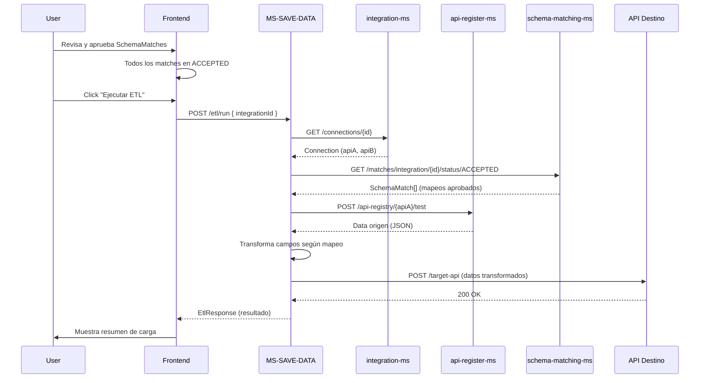
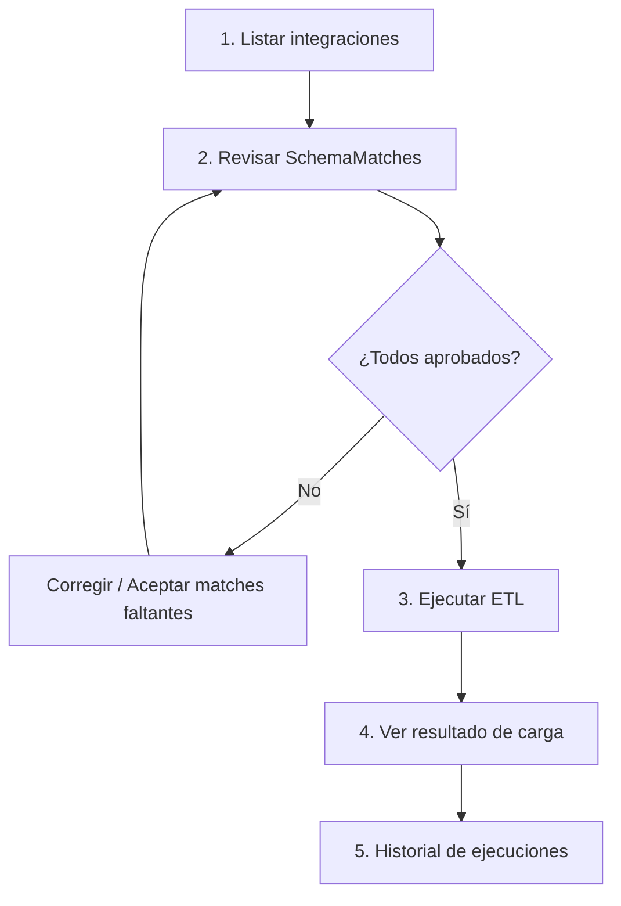

# MS-SAVE-DATA — Lógica de Ejecución ETL (Carga)

## Propósito

**MS-SAVE-DATA** es el microservicio encargado de la fase **"Load"** del proceso ETL. Una vez que los `SchemaMatch` han sido aprobados por el usuario, este servicio:

1. **Extrae** datos reales desde el API origen.
2. **Transforma** los campos según el mapeo aprobado (source → target).
3. **Carga** los datos transformados en el API destino.

---

## Flujo Completo (Frontend → MS-SAVE-DATA)



---

## Endpoint

### `POST /api/etl/run`

**Request Body:**
```json
{
  "integrationId": 1
}
```

| Campo          | Tipo | Obligatorio | Descripción                        |
|----------------|------|-------------|------------------------------------|
| `integrationId`| int  | Sí          | ID de la integración a ejecutar    |

**Response 200:**
```json
{
  "integrationId": 1,
  "sourceApiId": 5,
  "targetApiId": 8,
  "totalRecords": 150,
  "transformedRecords": 150,
  "loadedRecords": 150,
  "errors": []
}
```

| Campo              | Tipo     | Descripción                                      |
|--------------------|----------|--------------------------------------------------|
| `integrationId`    | int      | ID de la integración ejecutada                   |
| `sourceApiId`      | int      | ID del API origen (api-register-ms)              |
| `targetApiId`      | int      | ID del API destino (api-register-ms)             |
| `totalRecords`     | int      | Total de registros extraídos                     |
| `transformedRecords`| int     | Registros transformados exitosamente             |
| `loadedRecords`    | int      | Registros cargados exitosamente en destino       |
| `errors`           | string[] | Lista de errores ocurridos (vacío si todo ok)    |

### `POST /api/etl/run/{integrationId}`

Variante con el ID en la URL. Mismo comportamiento y response.

---

## Comportamiento Backend (por fase)

### Fase 1: Extracción (Extract)

- Obtiene la definición del API origen → `GET /api-registry/{id}`
- Ejecuta `POST /api-registry/{id}/test` con pathParams, queryParams y body registrados
- Parsea el body JSON de respuesta
- Si es un array `[]`, lo usa directamente
- Si tiene campo `data`, extrae esa lista
- Si es un objeto `{}`, lo envuelve en un array `[{}]`

### Fase 2: Transformación (Transform)

Por cada `SchemaMatch` con `status = ACCEPTED` o `APPROVED`:

| Regla | Comportamiento |
|-------|---------------|
| `sourceField` existe en el registro | el valor de `sourceField` se asigna a `targetField` |
| `sourceField` NO existe en el registro | se asigna `null` a `targetField` |
| `transformation` presente | se aplica la función de transformación |

**Transformaciones soportadas:**

| Expresión | Ejemplo | Resultado |
|-----------|---------|-----------|
| `int(value)` | `"123"` | `123` |
| `float(value)` | `"45.67"` | `45.67` |
| `str(value)` | `123` | `"123"` |
| `bool(value)` | `"true"` | `true` |
| `upper(value)` | `"hola"` | `"HOLA"` |
| `lower(value)` | `"HOLA"` | `"hola"` |

### Fase 3: Carga (Load)

- Obtiene la definición del API destino → `GET /api-registry/{id}`
- Construye headers de autenticación según el `authType` configurado
- Envía todos los registros transformados en una sola petición batch (`POST/PUT` según método del API destino)
- Reporta cuántos registros se cargaron y los errores individuales

---

## Implementación Frontend (React / TypeScript)

### 1. Hook o función de servicio

```typescript
// services/etlService.ts

export interface EtlRequest {
  integrationId: number;
}

export interface EtlResponse {
  integrationId: number;
  sourceApiId: number;
  targetApiId: number;
  totalRecords: number;
  transformedRecords: number;
  loadedRecords: number;
  errors: string[];
}

export async function runEtl(data: EtlRequest): Promise<EtlResponse> {
  const res = await fetch('/api/etl/run', {
    method: 'POST',
    headers: { 'Content-Type': 'application/json' },
    body: JSON.stringify(data),
  });
  if (!res.ok) throw new Error('Error al ejecutar ETL');
  return res.json();
}

export async function runEtlById(integrationId: number): Promise<EtlResponse> {
  const res = await fetch(`/api/etl/run/${integrationId}`, {
    method: 'POST',
  });
  if (!res.ok) throw new Error('Error al ejecutar ETL');
  return res.json();
}
```

### 2. Hook de estado para la ejecución

```typescript
// hooks/useEtlExecution.ts

import { useState, useCallback } from 'react';
import { runEtl, EtlResponse } from '../services/etlService';

export type EtlPhase = 'idle' | 'extracting' | 'transforming' | 'loading' | 'done' | 'error';

export function useEtlExecution() {
  const [phase, setPhase] = useState<EtlPhase>('idle');
  const [result, setResult] = useState<EtlResponse | null>(null);
  const [error, setError] = useState<string | null>(null);
  const [progress, setProgress] = useState(0);

  const execute = useCallback(async (integrationId: number) => {
    setPhase('extracting');
    setProgress(10);
    setError(null);
    setResult(null);

    try {
      setProgress(30);
      setPhase('transforming');

      setProgress(60);
      setPhase('loading');

      const response = await runEtl({ integrationId });

      setProgress(100);
      setPhase(response.errors.length === 0 ? 'done' : 'error');
      setResult(response);
      if (response.errors.length > 0) {
        setError(`Se cargaron ${response.loadedRecords} de ${response.totalRecords} registros`);
      }
    } catch (e) {
      setPhase('error');
      setResult(null);
      if (e instanceof Error) {
        setError(e.message);
      } else {
        setError('Error desconocido al ejecutar ETL');
      }
    }
  }, []);

  const reset = useCallback(() => {
    setPhase('idle');
    setResult(null);
    setError(null);
    setProgress(0);
  }, []);

  return { phase, result, error, progress, execute, reset };
}
```

### 3. Componente de ejecución ETL

```tsx
// components/EtlExecutionPanel.tsx

import { useEtlExecution, EtlPhase } from '../hooks/useEtlExecution';

interface Props {
  integrationId: number;
  hasApprovedMatches: boolean;
  onComplete: (result: EtlResponse) => void;
}

const phaseLabels: Record<EtlPhase, string> = {
  idle: 'Listo para ejecutar',
  extracting: 'Extrayendo datos del origen...',
  transforming: 'Transformando campos...',
  loading: 'Cargando datos en destino...',
  done: 'ETL completado',
  error: 'Error en ETL',
};

function EtlExecutionPanel({ integrationId, hasApprovedMatches, onComplete }: Props) {
  const { phase, result, error, progress, execute, reset } = useEtlExecution();

  const handleRun = async () => {
    await execute(integrationId);
  };

  const isRunning = phase === 'extracting' || phase === 'transforming' || phase === 'loading';
  const canRun = hasApprovedMatches && !isRunning;

  return (
    <div className="etl-execution-panel">
      <h3>Ejecutar Integración ETL</h3>

      {!hasApprovedMatches && (
        <div className="warning">
          ⚠ Debes aprobar al menos un SchemaMatch antes de ejecutar el ETL
        </div>
      )}

      {phase !== 'idle' && (
        <div className="progress-section">
          <div className="progress-bar">
            <div
              className="progress-fill"
              style={{ width: `${progress}%` }}
            />
          </div>
          <span className="phase-label">{phaseLabels[phase]}</span>
        </div>
      )}

      {result && (
        <div className={`result-card ${result.errors.length === 0 ? 'success' : 'partial'}`}>
          <div className="result-stats">
            <div className="stat">
              <span className="stat-value">{result.totalRecords}</span>
              <span className="stat-label">Extraídos</span>
            </div>
            <div className="stat">
              <span className="stat-value">{result.transformedRecords}</span>
              <span className="stat-label">Transformados</span>
            </div>
            <div className="stat">
              <span className="stat-value">{result.loadedRecords}</span>
              <span className="stat-label">Cargados</span>
            </div>
          </div>
          {result.errors.length > 0 && (
            <div className="errors">
              <h4>Errores ({result.errors.length})</h4>
              <ul>
                {result.errors.map((err, i) => (
                  <li key={i}>{err}</li>
                ))}
              </ul>
            </div>
          )}
        </div>
      )}

      {error && !result && (
        <div className="error-message">{error}</div>
      )}

      <div className="actions">
        <button
          onClick={handleRun}
          disabled={!canRun}
          className="btn-primary"
        >
          {isRunning ? 'Ejecutando...' : '▶ Ejecutar ETL'}
        </button>
        {phase === 'done' && (
          <button onClick={reset} className="btn-secondary">
            Reiniciar
          </button>
        )}
      </div>
    </div>
  );
}
```

### 4. Estados de UI

| Estado     | Progreso | Acción del usuario       | UI                                          |
|------------|----------|--------------------------|---------------------------------------------|
| `idle`     | 0%       | Click "Ejecutar ETL"     | Botón habilitado (si hay matches aprobados) |
| `extracting`| 10-30%  | —                        | Barra de progreso + "Extrayendo datos..."  |
| `transforming`| 30-60% | —                        | Barra de progreso + "Transformando..."      |
| `loading`  | 60-90%   | —                        | Barra de progreso + "Cargando..."           |
| `done`     | 100%     | Ver resultado, Reiniciar | Card verde con stats                        |
| `error`    | varía    | Reintentar               | Card roja/amarilla con detalles del error  |

### 5. Pantalla de resumen de integración

Flujo completo que debe ofrecer el frontend:



---

## Integración desde el Frontend (flujo completo)

Para integrar la ejecución ETL en tu página de detalle de integración:

```typescript
// pages/IntegrationDetail.tsx

function IntegrationDetailPage() {
  const { integrationId } = useParams();
  const [matches, setMatches] = useState<SchemaMatch[]>([]);
  const [etlResult, setEtlResult] = useState<EtlResponse | null>(null);

  // Obtener matches de la integración
  useEffect(() => {
    fetch(`/api/schema-matches/integration/${integrationId}`)
      .then(res => res.json())
      .then(setMatches);
  }, [integrationId]);

  const approvedCount = matches.filter(
    m => m.status === 'ACCEPTED' || m.status === 'APPROVED'
  ).length;

  const hasApprovedMatches = approvedCount > 0;

  const handleEtlComplete = (result: EtlResponse) => {
    setEtlResult(result);
    // Opcional: refrescar historial de ejecuciones
  };

  return (
    <div>
      <h2>Integración #{integrationId}</h2>

      {/* Lista de SchemaMatches con feedback */}
      <MatchList
        matches={matches}
        integrationId={integrationId}
        onMatchesUpdated={setMatches}
      />

      {/* Panel de ejecución ETL */}
      <EtlExecutionPanel
        integrationId={Number(integrationId)}
        hasApprovedMatches={hasApprovedMatches}
        onComplete={handleEtlComplete}
      />

      {/* Resultado de última ejecución */}
      {etlResult && <EtlResultDetails result={etlResult} />}
    </div>
  );
}
```

---

## Reglas de validación en Frontend

1. **No ejecutar si no hay matches aprobados**: Botón deshabilitado si `approvedCount === 0`
2. **Confirmación antes de ejecutar**: Mostrar "¿Estás seguro de ejecutar el ETL? Se cargarán datos en el sistema destino"
3. **Bloquear UI durante ejecución**: Deshabilitar botones de feedback y navegación mientras corre el ETL
4. **Mostrar progreso**: Usar barra de progreso con fases (extracting → transforming → loading)
5. **Resultado parcial**: Si `loadedRecords < totalRecords`, mostrar alerta amarilla con los errores
6. **Manejar timeout**: Si la petición tarda > 2min, mostrar opción de reintentar

---

## Posibles errores HTTP

| Código | Significado                           | Manejo frontend                                |
|--------|---------------------------------------|------------------------------------------------|
| 200    | ETL completado (con o sin errores)    | Mostrar stats, errores si los hay              |
| 400    | integrationId inválido                | Mostrar "Integración no válida"                |
| 502    | Error en comunicación con otros MS    | Mostrar "Error de conexión con servicios internos" + reintentar |
| 504    | Timeout en carga de datos             | Mostrar "La carga está tomando más tiempo de lo esperado" + reintentar |
