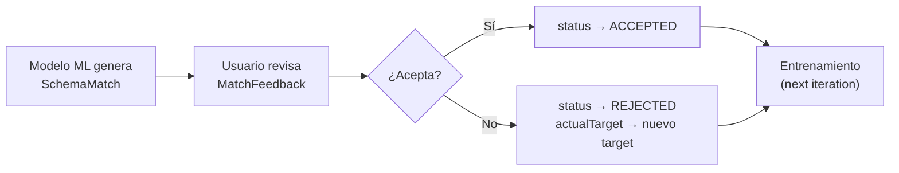

# SchemaMatch — Documentación del Microservicio

## Propósito

Microservicio encargado de gestionar los matches generados por el motor de Machine Learning entre campos de origen (`sourceField`) y destino (`targetField`) de dos APIs conectadas en una integración. Permite visualizar, corregir y entrenar el modelo con feedback humano.

---

## Entidades

### SchemaMatch

Representa un mapeo entre un campo de la API A (origen) y un campo de la API B (destino).

| Campo           | Tipo            | Descripción                                              |
|-----------------|-----------------|----------------------------------------------------------|
| id              | Long            | ID autoincremental                                       |
| integrationId   | Long            | ID de la integración a la que pertenece el match         |
| sourceField     | String(500)     | Campo de origen (API A)                                  |
| targetField     | String(500)     | Campo de destino (API B) sugerido por el modelo          |
| confidence      | BigDecimal(5,4) | Confianza del modelo (0.0000 – 1.0000)                   |
| status          | MatchStatus     | `PENDING` / `ACCEPTED` / `REJECTED`                      |
| transformation  | Text            | Expresión/función de transformación entre campos (opcional) |
| reviewedBy      | Long            | ID del usuario que revisó el match                       |
| reviewedAt      | LocalDateTime   | Fecha de revisión                                        |
| createdAt       | LocalDateTime   | Fecha de creación                                        |

### MatchStatus

| Valor    | Significado                        |
|----------|------------------------------------|
| PENDING  | Pendiente de revisión humana       |
| ACCEPTED | Aprobado por el usuario            |
| REJECTED | Rechazado por el usuario           |

### MatchFeedback

Registro de la acción de revisión del usuario. Se usa como **ground truth** para entrenar el modelo.

| Campo        | Tipo       | Descripción                                            |
|--------------|------------|--------------------------------------------------------|
| id           | Long       | ID autoincremental                                     |
| matchId      | Long       | ID del SchemaMatch al que pertenece                    |
| userApproved | Boolean    | `true` = aceptado, `false` = rechazado                 |
| actualTarget | String(500)| Target corregido por el usuario (opcional)             |
| createdAt    | LocalDateTime | Fecha del feedback                                  |

---

## Endpoints de la API

### SchemaMatchController

**Base URL:** `/api/schema-matches`

#### `GET /api/schema-matches`
Lista todos los matches.

**Response:** `SchemaMatchResponseDTO[]`

#### `GET /api/schema-matches/integration/{integrationId}`
Lista matches de una integración específica.

**Response:** `SchemaMatchResponseDTO[]`

#### `GET /api/schema-matches/integration/{integrationId}/status/{status}`
Filtra matches por estado (`PENDING`, `ACCEPTED`, `REJECTED`).

**Response:** `SchemaMatchResponseDTO[]`

#### `GET /api/schema-matches/{id}`
Obtiene un match por ID.

**Response:** `SchemaMatchResponseDTO`

#### `POST /api/schema-matches`
Crea un nuevo match.

**Request Body:**
```json
{
  "integrationId": 1,
  "sourceField": "user_id",
  "targetField": "client_id",
  "confidence": 0.95,
  "status": "PENDING",
  "transformation": "Integer.parseInt(value)",
  "reviewedBy": null
}
```

**Response:** `SchemaMatchResponseDTO` (status 201)

#### `POST /api/schema-matches/batch`
Crea múltiples matches en una sola petición.

**Request Body:**
```json
{
  "matches": [
    { "integrationId": 1, "sourceField": "name", "targetField": "nombre", "confidence": 0.98 },
    { "integrationId": 1, "sourceField": "email", "targetField": "correo", "confidence": 0.92 }
  ]
}
```

**Response:** `SchemaMatchResponseDTO[]` (status 201)

#### `PUT /api/schema-matches/{id}`
Actualiza un match existente.

**Request Body:** `SchemaMatchRequestDTO`

**Response:** `SchemaMatchResponseDTO`

#### `PATCH /api/schema-matches/{id}/status`
Actualiza solo el estado de un match (útil para aprobar/rechazar sin feedback completo).

| QueryParam   | Tipo | Obligatorio | Descripción                       |
|-------------|------|-------------|-----------------------------------|
| status      | MatchStatus | Sí | Nuevo estado (`ACCEPTED`, `REJECTED`) |
| reviewedBy  | Long | No          | ID del usuario que revisa        |

**Response:** `SchemaMatchResponseDTO`

#### `DELETE /api/schema-matches/{id}`
Elimina un match.

**Response:** 204 No Content

#### `POST /api/schema-matches/feedback`
Envía feedback de un match. Además de guardar el feedback, actualiza el `SchemaMatch` automáticamente.

**Request Body:**
```json
{
  "matchId": 1,
  "userApproved": true,
  "actualTarget": "nombre_completo",
  "reviewedBy": 42
}
```

| Campo         | Tipo     | Obligatorio | Descripción                                           |
|---------------|----------|-------------|-------------------------------------------------------|
| `matchId`     | Long     | Sí          | ID del SchemaMatch a revisar                          |
| `userApproved`| Boolean  | Sí          | `true` = aceptado, `false` = rechazado                |
| `actualTarget`| String   | No          | Target corregido (si se omite se mantiene el original)|
| `reviewedBy`  | Long     | Sí          | ID del usuario que revisa                             |

**Response:** `MatchFeedbackResponseDTO` (status 201)

**Efectos secundarios en SchemaMatch:**
- `userApproved = true` → `status = ACCEPTED`
- `userApproved = false` → `status = REJECTED`
- `actualTarget` presente → `targetField = actualTarget`
- Siempre: `reviewedBy`, `reviewedAt` actualizados
- Si el match ya fue revisado (`status != PENDING`) → error 409

#### `GET /api/schema-matches/{id}/feedback`
Obtiene el historial de feedbacks de un match.

**Response:** `MatchFeedbackResponseDTO[]`

---

## DTOs

### SchemaMatchRequestDTO
```json
{
  "integrationId": 1,
  "sourceField": "user_id",
  "targetField": "client_id",
  "confidence": 0.95,
  "status": "PENDING",
  "transformation": "Integer.parseInt(value)",
  "reviewedBy": null
}
```

### SchemaMatchResponseDTO
```json
{
  "id": 1,
  "integrationId": 1,
  "sourceField": "user_id",
  "targetField": "client_id",
  "confidence": 0.9500,
  "status": "PENDING",
  "transformation": "Integer.parseInt(value)",
  "reviewedBy": null,
  "reviewedAt": null,
  "createdAt": "2026-05-14T10:00:00"
}
```

### MatchFeedbackResponseDTO
```json
{
  "id": 10,
  "matchId": 1,
  "userApproved": true,
  "actualTarget": "client_id",
  "createdAt": "2026-05-14T12:00:00"
}
```

---

## Reglas de Negocio

| Regla | Comportamiento |
|-------|---------------|
| **Unicidad** | No pueden existir dos matches con el mismo `integrationId` + `sourceField` |
| **Confidence** | Decimal de precisión 5, escala 4 (rango 0.0000 – 1.0000) |
| **Feedback único** | Un match solo puede recibir feedback si está `PENDING`. Luego de revisado, el endpoint retorna error |
| **Actualización en cascada** | Al crear feedback, el `SchemaMatch` se actualiza automáticamente (status, targetField, reviewedBy, reviewedAt) |
| **Soft delete** | No existe borrado lógico; `DELETE` elimina el registro permanentemente |

---

## Flujo de Datos (Feedback para entrenamiento)



Cada `MatchFeedback` con `actualTarget` se considera **ground truth** para el reentrenamiento del modelo.

---

## Integración con otros servicios

### schema-matching-ms → integration-ms
El `IntegrationService` dentro de schema-matching-ms consulta a `integration-ms` (puerto 8082 por defecto) para obtener datos de la conexión:
```
GET /api/integrations/connections/{connectionId}
```

### schema-matching-ms → matcher-ms
No hay llamada directa desde este MS. El `integration-ms` llama al matcher al crear una integración.

---

## Códigos de Error

| HTTP | Causa |
|------|-------|
| 400  | Validación de DTO falla (campos requeridos) |
| 404  | SchemaMatch no encontrado |
| 409  | Match ya revisado / Match duplicado |
| 500  | Error interno |
