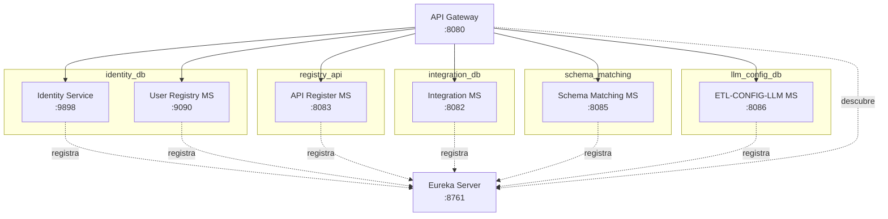
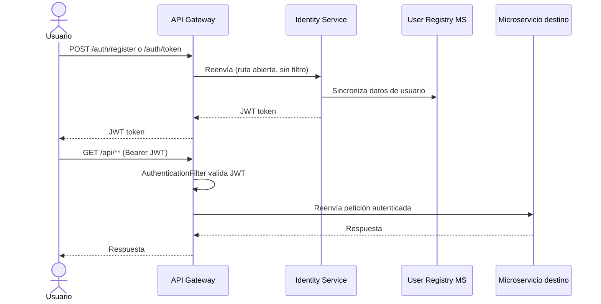
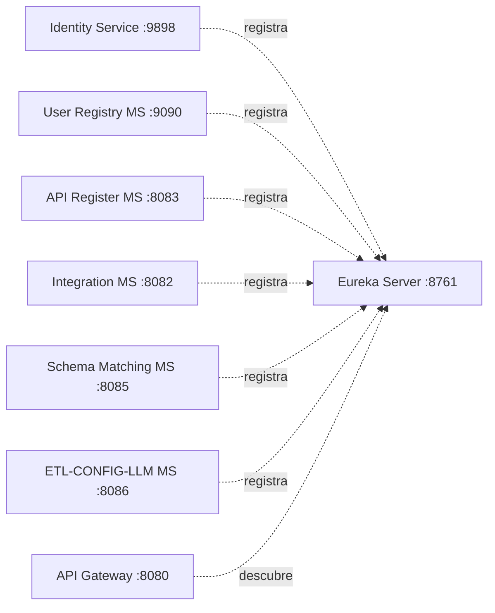
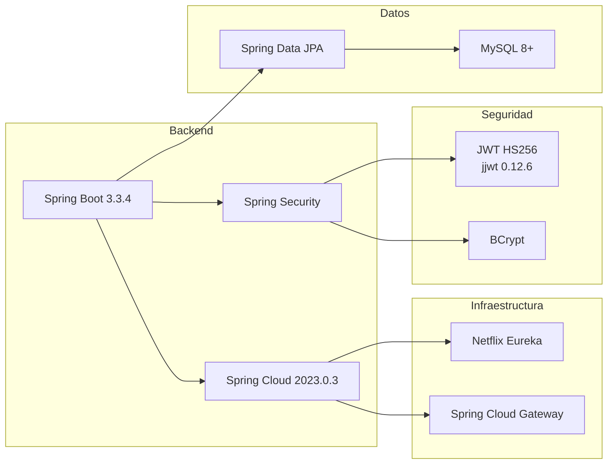
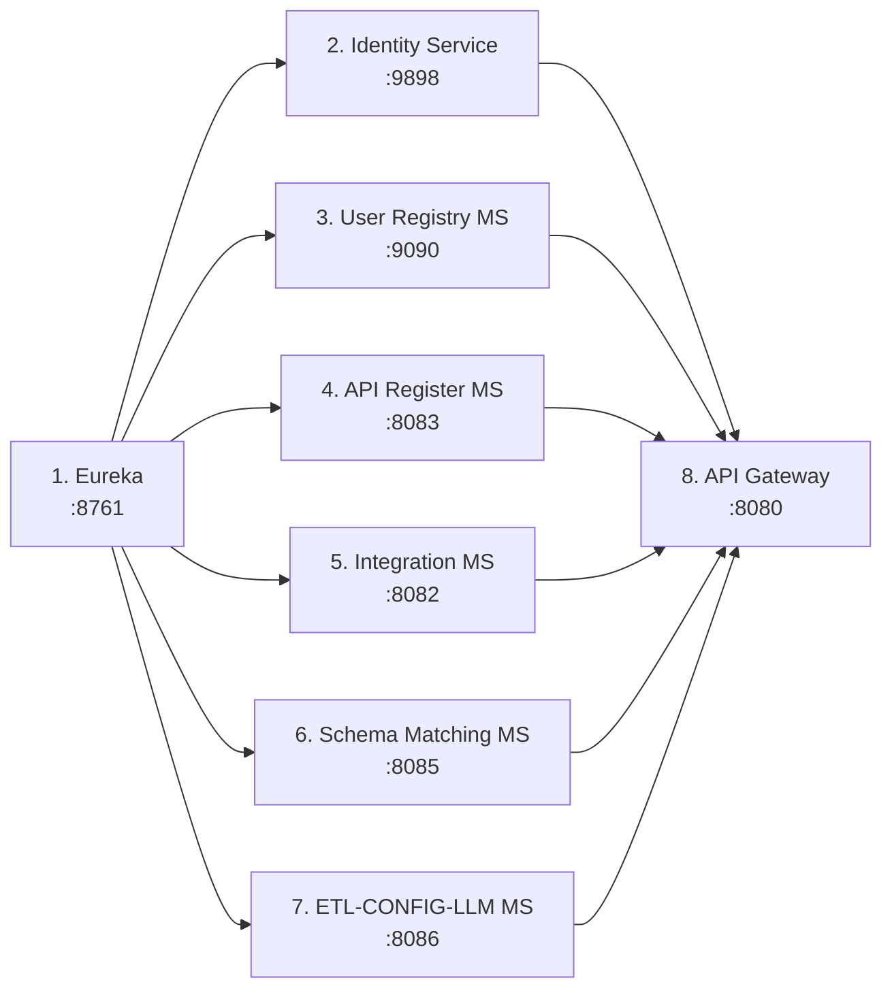
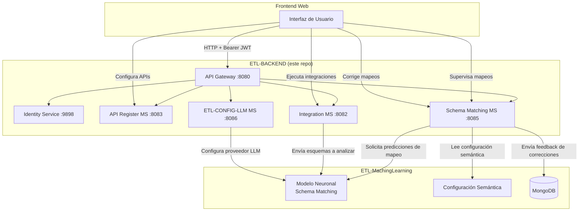

# ETL-BACKEND

Backend de microservicios para la plataforma web **ETL-MachingLearning**. Proporciona la infraestructura necesaria para que los usuarios puedan configurar APIs, supervisar el mapeo de campos generado por el modelo de Machine Learning, realizar correcciones manuales y ejecutar integraciones ETL entre sistemas empresariales como **NetSuite** y **Oracle Primavera Unifier**.

---

## Tabla de Contenidos

- [Descripción General](#descripción-general)
- [Arquitectura de Microservicios](#arquitectura-de-microservicios)
- [Diagrama Entidad-Relación](#diagrama-entidad-relación)
- [Flujo de Autenticación](#flujo-de-autenticación)
- [Detalle de Microservicios](#detalle-de-microservicios)
- [Tecnologías](#tecnologías)
- [Requisitos Previos](#requisitos-previos)
- [Instalación y Ejecución](#instalación-y-ejecución)
- [Endpoints de la API](#endpoints-de-la-api)
- [Relación con ETL-MachingLearning](#relación-con-etl-machinglearning)
- [Contribuir](#contribuir)

---

## Descripción General

Este repositorio contiene el backend de la plataforma ETL, construido con una arquitectura de microservicios usando **Spring Boot** y **Spring Cloud**. Su objetivo es servir como la capa web que permite a los usuarios:

- **Configurar APIs** de origen y destino para procesos ETL.
- **Supervisar el mapeo** de campos generado automáticamente por el módulo de Machine Learning.
- **Corregir manualmente** las equivalencias de campos cuando sea necesario.
- **Ejecutar integraciones** entre los sistemas conectados.

---

## Arquitectura de Microservicios



---

## Diagrama Entidad-Relación

> Las relaciones marcadas como **LOGICAL FK** son referencias lógicas entre microservicios distintos. MySQL/InnoDB no soporta `FOREIGN KEY` cross-database, por lo que la integridad referencial es responsabilidad de la capa de aplicación.

```mermaid
erDiagram

  %% ── identity_db ──────────────────────────────────────────
  user_credentials {
    bigint id PK
    varchar username
    varchar email
    varchar password
    varchar role
    boolean enabled
    bigint user_ref_id "LOGICAL FK → user.id"
  }

  user {
    bigint id PK
    varchar username
    varchar email
    varchar password_hash
    varchar first_name
    varchar last_name
    varchar status
    bigint created_by "LOGICAL FK → user.id"
  }

  role {
    bigint id PK
    varchar name
    varchar description
    bigint level_role
    boolean is_system
  }

  user_role {
    bigint usuario_id PK "LOGICAL FK → user.id"
    bigint rol_id PK "LOGICAL FK → role.id"
    bigint assigned_by "LOGICAL FK → user.id"
    datetime assigned_at
  }

  password_reset_token {
    bigint id PK
    varchar token
    bigint user_id "LOGICAL FK → user.id"
    datetime expiry_date
    boolean used
  }

  %% ── registry_api ──────────────────────────────────────────
  http_methods {
    bigint id PK
    varchar name
  }

  apis {
    bigint id PK
    bigint method_id FK
    varchar url
    varchar description
    bigint auth_api_id FK
  }

  api_endpoint {
    bigint id PK "FK herencia JOINED → apis.id"
    varchar path_params
    varchar query_params
    text body
  }

  api_headers {
    bigint id PK
    varchar value
  }

  auth_credential {
    bigint id PK
    text credential_value
  }

  auth_config {
    bigint id PK
    bigint api_id FK
    varchar auth_type
    bigint header_id FK
    bigint auth_credential_id FK
    varchar username
    varchar token_endpoint
    datetime token_expiry
  }

  %% ── integration_db ────────────────────────────────────────
  integrations {
    bigint id PK
    varchar api_a "LOGICAL FK → registry_api.apis.id"
    varchar api_b "LOGICAL FK → registry_api.apis.id"
    varchar description
    varchar status
    bigint created_by "LOGICAL FK → identity_db.user.id"
    bigint updated_by "LOGICAL FK → identity_db.user.id"
  }

  %% ── schema_matching ───────────────────────────────────────
  schema_match {
    bigint id PK
    bigint integration_id "LOGICAL FK → integration_db.integrations.id"
    varchar source_field
    varchar target_field
    decimal confidence
    varchar status
    text transformation
    bigint reviewed_by "LOGICAL FK → identity_db.user.id"
    bigint created_by "LOGICAL FK → identity_db.user.id"
    datetime reviewed_at
  }

  match_feedback {
    bigint id PK
    bigint match_id "LOGICAL FK → schema_match.id"
    boolean user_approved
    varchar actual_target
    bigint reviewed_by "LOGICAL FK → identity_db.user.id"
  }

  %% ── llm_config_db ─────────────────────────────────────────
  llm_config {
    bigint id PK
    varchar name
    varchar provider
    varchar api_key
    varchar base_url
    varchar model_name
    boolean is_default
    varchar status
    bigint created_by "LOGICAL FK → identity_db.user.id"
    bigint updated_by "LOGICAL FK → identity_db.user.id"
  }

  %% ── execution_log (una instancia por cada DB) ─────────────
  execution_log {
    varchar id PK
    varchar parent_id "LOGICAL FK → execution_log.id"
    varchar execution_id
    varchar service_name
    varchar class_name
    varchar method_name
    varchar log_level
    varchar message
    longtext detail
    datetime timestamp
    bigint duration_ms
    varchar integration_id "LOGICAL FK → integration_db.integrations.id"
  }

  %% ══ RELACIONES INTERNAS — FK reales (misma DB) ════════════
  apis          ||--o{ api_endpoint       : "herencia JOINED"
  apis          }o--||  http_methods      : "method_id"
  apis          }o--o|  apis              : "auth_api_id (self)"
  auth_config   }o--o|  apis              : "api_id"
  auth_config   }o--o|  api_headers       : "header_id"
  auth_config   }o--o|  auth_credential   : "auth_credential_id"

  user          ||--o{ user_role            : "usuario_id"
  role          ||--o{ user_role            : "rol_id"
  user          ||--o{ password_reset_token : "user_id"
  user          }o--o| user                 : "created_by (self)"
  user_role     }o--o| user                 : "assigned_by"

  schema_match  ||--o{ match_feedback : "match_id"

  %% ══ RELACIONES LÓGICAS CROSS-MS (sin FK real) ════════════
  user          ||--o|  user_credentials : "user_ref_id"
  apis          ||--o{  integrations     : "api_a / api_b"
  user          ||--o{  integrations     : "created_by / updated_by"
  integrations  ||--o{  schema_match     : "integration_id"
  user          ||--o{  schema_match     : "reviewed_by / created_by"
  user          ||--o{  match_feedback   : "reviewed_by"
  user          ||--o{  llm_config       : "created_by / updated_by"
  integrations  ||--o{  execution_log    : "integration_id"
  execution_log }o--o|  execution_log    : "parent_id (self)"
```



---

## Flujo de Autenticación



---

## Detalle de Microservicios

### 1. Service Registry (Eureka Server)

| Propiedad      | Valor                       |
|----------------|-----------------------------|
| **Puerto**     | 8761                        |
| **Tecnología** | Netflix Eureka Server       |
| **Función**    | Descubrimiento de servicios |

No se registra a sí mismo (`register-with-eureka: false`, `fetch-registry: false`).



---

### 2. API Gateway (Spring Cloud Gateway)

| Propiedad      | Valor                                    |
|----------------|------------------------------------------|
| **Puerto**     | 8080                                     |
| **Tecnología** | Spring Cloud Gateway (WebFlux)           |
| **Función**    | Punto de entrada único, routing y auth   |

**Rutas configuradas:**

| Ruta              | Servicio destino         | Autenticación              |
|-------------------|--------------------------|----------------------------|
| `/auth/**`        | IDENTITY-SERVICE (lb)    | No (ruta abierta)          |
| `/users/**`       | USER-REGISTRY-MS (lb)    | Sí (AuthenticationFilter)  |
| `/apis/**`        | API-REGISTER-MS (lb)     | Sí (AuthenticationFilter)  |
| `/integrations/**`| INTEGRATION-MS (lb)      | Sí (AuthenticationFilter)  |
| `/schema/**`      | SCHEMA-MATCHING-MS (lb)  | Sí (AuthenticationFilter)  |
| `/llm/**`         | ETL-CONFIG-LLM-MS (lb)   | Sí (AuthenticationFilter)  |

**Rutas abiertas (sin autenticación):** `/auth/register`, `/auth/token`, `/eureka`

---

### 3. Identity Service

| Propiedad         | Valor                                  |
|-------------------|----------------------------------------|
| **Puerto**        | 9898                                   |
| **Base de datos** | identity_db (MySQL)                    |
| **Función**       | Registro, login, generación de JWT     |
| **Seguridad**     | Spring Security + BCrypt + JWT HS256   |

Gestiona las credenciales de acceso (`user_credentials`) y genera los tokens JWT consumidos por el API Gateway.

---

### 4. User Registry MS

| Propiedad         | Valor                                  |
|-------------------|----------------------------------------|
| **Puerto**        | 9090                                   |
| **Base de datos** | identity_db (MySQL)                    |
| **Función**       | Gestión completa de usuarios y roles   |

Administra las tablas `user`, `role`, `user_role` y `password_reset_token`. Se sincroniza con Identity Service mediante el campo `user_ref_id`.

---

### 5. API Register MS

| Propiedad         | Valor                                         |
|-------------------|-----------------------------------------------|
| **Puerto**        | 8083                                          |
| **Base de datos** | registry_api (MySQL)                          |
| **Función**       | Registro y configuración de APIs origen/destino |

Almacena los endpoints (`apis`, `api_endpoint`), headers (`api_headers`) y configuraciones de autenticación (`auth_config`, `auth_credential`) para las APIs externas que participan en las integraciones ETL.

---

### 6. Integration MS

| Propiedad         | Valor                                       |
|-------------------|---------------------------------------------|
| **Puerto**        | 8082                                        |
| **Base de datos** | integration_db (MySQL)                      |
| **Función**       | Orquestación y ejecución de integraciones ETL |

Gestiona el ciclo de vida de las integraciones (`integrations`), vinculando una API origen (`api_a`) con una API destino (`api_b`) y coordinando la ejecución del proceso ETL.

---

### 7. Schema Matching MS

| Propiedad         | Valor                                              |
|-------------------|----------------------------------------------------|
| **Puerto**        | 8085                                               |
| **Base de datos** | schema_matching (MySQL)                            |
| **Función**       | Mapeo de campos entre esquemas origen y destino    |

Recibe las predicciones del modelo ML y las almacena en `schema_match`. Permite la revisión y corrección manual a través de `match_feedback`. El campo `confidence` indica el nivel de confianza del modelo para cada mapeo.

---

### 8. ETL-CONFIG-LLM MS

| Propiedad         | Valor                                        |
|-------------------|----------------------------------------------|
| **Puerto**        | 8086                                         |
| **Base de datos** | llm_config_db (MySQL)                        |
| **Función**       | Gestión de configuraciones de modelos LLM/ML |

Almacena las configuraciones de los proveedores de LLM (`llm_config`): API key, URL base, modelo y parámetros. Permite cambiar de proveedor (OpenAI, Anthropic, local, etc.) sin modificar el código.

---

## Tecnologías



| Componente        | Tecnología                    |
|-------------------|-------------------------------|
| Lenguaje          | Java 21                       |
| Framework         | Spring Boot 3.3.4             |
| Cloud             | Spring Cloud 2023.0.3         |
| Gateway           | Spring Cloud Gateway (WebFlux)|
| Service Discovery | Netflix Eureka                |
| Seguridad         | Spring Security + JWT (HS256) |
| Base de Datos     | MySQL 8+                      |
| ORM               | Spring Data JPA               |
| Build             | Maven                         |
| Utilidades        | Lombok                        |

---

## Requisitos Previos

- **Java** 21 o superior
- **Maven** 3.9+ (o usar el wrapper `mvnw` incluido)
- **MySQL** 8+ con las bases de datos creadas (ver `create_databases.sql`)

### Crear las bases de datos

```bash
mysql -u root -p < create_databases.sql
```

Esto crea y configura: `identity_db`, `registry_api`, `integration_db`, `schema_matching` y `llm_config_db`.

---

## Instalación y Ejecución

### 1. Clonar el repositorio

```bash
git clone https://github.com/ByAncort/ETL-BACKEND.git
cd ETL-BACKEND
```

### 2. Orden de inicio de los servicios

Los servicios deben iniciarse en el siguiente orden:



```bash
# 1. Service Registry (Eureka)
cd service-registry
./mvnw spring-boot:run

# 2. Identity Service
cd identity-service
./mvnw spring-boot:run

# 3. User Registry MS
cd user-registry-ms
./mvnw spring-boot:run

# 4. API Register MS
cd api-register-ms
./mvnw spring-boot:run

# 5. Integration MS
cd integration-ms
./mvnw spring-boot:run

# 6. Schema Matching MS
cd schema-matching-ms
./mvnw spring-boot:run

# 7. ETL-CONFIG-LLM MS
cd ETL-CONFIG-LLM-MS
./mvnw spring-boot:run

# 8. API Gateway (último, cuando todos estén registrados)
cd api-gateway
./mvnw spring-boot:run
```

### 3. Verificar que los servicios están registrados

Accede al dashboard de Eureka: [http://localhost:8761](http://localhost:8761)

Deben aparecer registrados: `IDENTITY-SERVICE`, `USER-REGISTRY-MS`, `API-REGISTER-MS`, `INTEGRATION-MS`, `SCHEMA-MATCHING-MS`, `ETL-CONFIG-LLM-MS` y `API-GATEWAY`.

---

## Endpoints de la API

Todas las peticiones pasan por el **API Gateway** en `http://localhost:8080`.

### Autenticación (rutas abiertas)

| Método | Ruta             | Body                                              | Descripción               |
|--------|------------------|---------------------------------------------------|---------------------------|
| POST   | `/auth/register` | `{"username":"...", "email":"...", "password":"..."}` | Registrar nuevo usuario   |
| POST   | `/auth/token`    | `{"username":"...", "password":"..."}`            | Obtener token JWT (login) |
| GET    | `/auth/validate` | `?token=<jwt>`                                    | Validar token JWT         |

### Usuarios (requiere Bearer JWT)

| Método | Ruta            | Descripción                    |
|--------|-----------------|--------------------------------|
| GET    | `/users`        | Listar usuarios                |
| GET    | `/users/{id}`   | Obtener usuario por ID         |
| PUT    | `/users/{id}`   | Actualizar usuario             |
| DELETE | `/users/{id}`   | Eliminar usuario               |

### APIs (requiere Bearer JWT)

| Método | Ruta          | Descripción                  |
|--------|---------------|------------------------------|
| GET    | `/apis`       | Listar APIs registradas      |
| POST   | `/apis`       | Registrar nueva API          |
| GET    | `/apis/{id}`  | Obtener API por ID           |
| PUT    | `/apis/{id}`  | Actualizar API               |
| DELETE | `/apis/{id}`  | Eliminar API                 |

### Integraciones (requiere Bearer JWT)

| Método | Ruta                    | Descripción                        |
|--------|-------------------------|------------------------------------|
| GET    | `/integrations`         | Listar integraciones               |
| POST   | `/integrations`         | Crear nueva integración            |
| GET    | `/integrations/{id}`    | Obtener integración por ID         |
| POST   | `/integrations/{id}/run`| Ejecutar integración ETL           |

### Schema Matching (requiere Bearer JWT)

| Método | Ruta                        | Descripción                        |
|--------|-----------------------------|------------------------------------|
| GET    | `/schema/{integrationId}`   | Ver mapeos de una integración      |
| PUT    | `/schema/{id}/approve`      | Aprobar mapeo                      |
| PUT    | `/schema/{id}/reject`       | Rechazar y corregir mapeo          |
| POST   | `/schema/{id}/feedback`     | Enviar feedback al modelo          |

### Configuración LLM (requiere Bearer JWT)

| Método | Ruta           | Descripción                        |
|--------|----------------|------------------------------------|
| GET    | `/llm`         | Listar configuraciones LLM         |
| POST   | `/llm`         | Crear configuración LLM            |
| PUT    | `/llm/{id}`    | Actualizar configuración           |
| PUT    | `/llm/{id}/default` | Establecer como predeterminado|

### Ejemplo de uso

```bash
# 1. Registrar usuario
curl -X POST http://localhost:8080/auth/register \
  -H "Content-Type: application/json" \
  -d '{"username":"admin", "email":"admin@etl.com", "password":"secret123"}'

# 2. Obtener token
TOKEN=$(curl -s -X POST http://localhost:8080/auth/token \
  -H "Content-Type: application/json" \
  -d '{"username":"admin", "password":"secret123"}' | tr -d '"')

# 3. Listar integraciones
curl http://localhost:8080/integrations \
  -H "Authorization: Bearer $TOKEN"

# 4. Ver mapeos de una integración
curl http://localhost:8080/schema/1 \
  -H "Authorization: Bearer $TOKEN"
```

---

## Relación con ETL-MachingLearning



Este backend es la capa de servicio que conecta el **frontend web** con el motor de **Machine Learning**:

- **Configuración de APIs:** Los usuarios registran las APIs de origen y destino (NetSuite, Oracle Primavera, etc.) desde la interfaz web.
- **Supervisión de mapeo:** El modelo ML genera predicciones de equivalencia de campos con un índice de confianza. Los usuarios pueden revisar cada mapeo desde el panel de Schema Matching.
- **Correcciones manuales:** Si el modelo falla en algún mapeo, los usuarios pueden rechazarlo y definir manualmente el campo correcto. El feedback se envía de vuelta al modelo para reentrenamiento.
- **Ejecución de integraciones:** Una vez validado el mapeo completo, los usuarios ejecutan el proceso ETL completo desde el panel de integraciones.
- **Gestión de LLM:** El microservicio `ETL-CONFIG-LLM-MS` permite cambiar de proveedor de modelo (OpenAI, Anthropic, modelo local, etc.) sin modificar el resto del sistema.

---

## Contribuir

1. Haz un fork del repositorio.
2. Crea una rama para tu feature: `git checkout -b feature/nueva-funcionalidad`
3. Realiza tus cambios y haz commit: `git commit -m "Agregar nueva funcionalidad"`
4. Sube tu rama: `git push origin feature/nueva-funcionalidad`
5. Abre un Pull Request.
