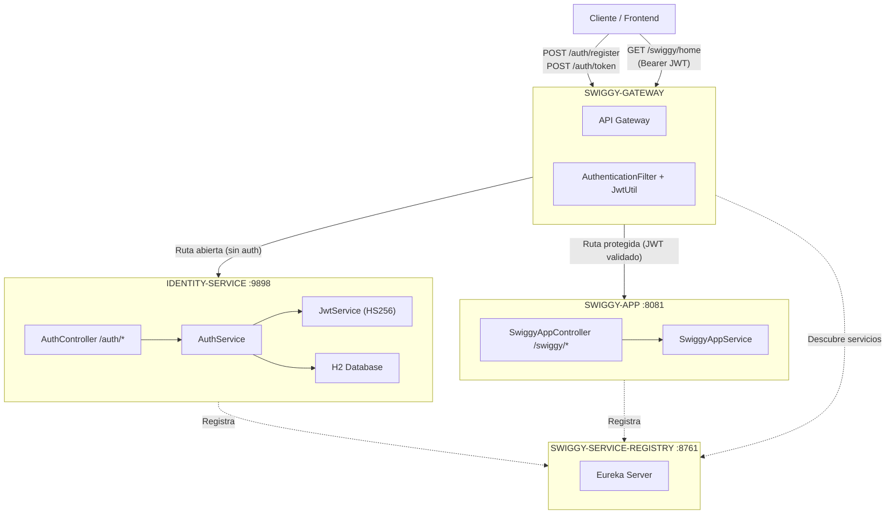

# ETL-BACKEND

## Detalle de Microservicios
### 1. swiggy-service-registry (Eureka Server)
- **Puerto:** 8761
- **Funcion:** Servidor de descubrimiento de servicios
- **Tecnologia:** Netflix Eureka Server
- No se registra a si mismo (`register-with-eureka: false`)
### 2. swiggy-gateway (API Gateway)
- **Tecnologia:** Spring Cloud Gateway (WebFlux)
- **Funcion:** Punto de entrada unico para todas las peticiones
- **Rutas configuradas:**
  | Ruta | Servicio destino | Filtro de autenticacion |
  |------|-----------------|------------------------|
  | `/swiggy/**` | SWIGGY-APP (lb) | Si (AuthenticationFilter) |
  | `/restaurant/**` | RESTAURANT-SERVICE (lb) | Si (AuthenticationFilter) |
  | `/auth/**` | IDENTITY-SERVICE (lb) | No (ruta abierta) |
- **Rutas abiertas (sin auth):** `/auth/register`, `/auth/token`, `/eureka`
### 3. identity-service (Autenticacion)
- **Puerto:** 9898
- **Funcion:** Registro de usuarios, login, generacion y validacion de JWT
- **Base de datos:** H2 (en memoria)
- **Seguridad:** Spring Security + BCrypt + JWT (HS256)
- **Entidad UserCredential:** `id`, `name`, `email`, `password`
- **Endpoints:**
  - `POST /auth/register` - Registrar nuevo usuario
  - `POST /auth/token` - Obtener token JWT (login)
  - `GET /auth/validate?token=` - Validar token JWT
### 4. swiggy-app (Servicio de Negocio)
- **Puerto:** 8081
- **Funcion:** Logica de negocio de la aplicacion
- **RestTemplate** con `@LoadBalanced` para comunicacion inter-servicios
- **RestaurantServiceClient** (actualmente comentado) para consultar ordenes
- **Endpoint activo:** `GET /swiggy/home` -> "Welcome to Swiggy App Service"
### 5. restaurant-service (Externo)
- **No incluido en el repositorio**
- **Referenciado** en el gateway y en `RestaurantServiceClient`
- Ruta esperada: `/restaurant/orders/status/{orderId}`
