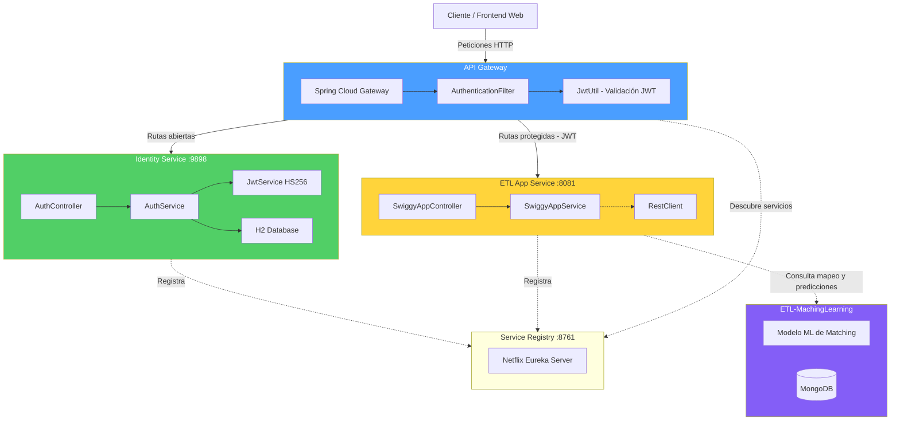
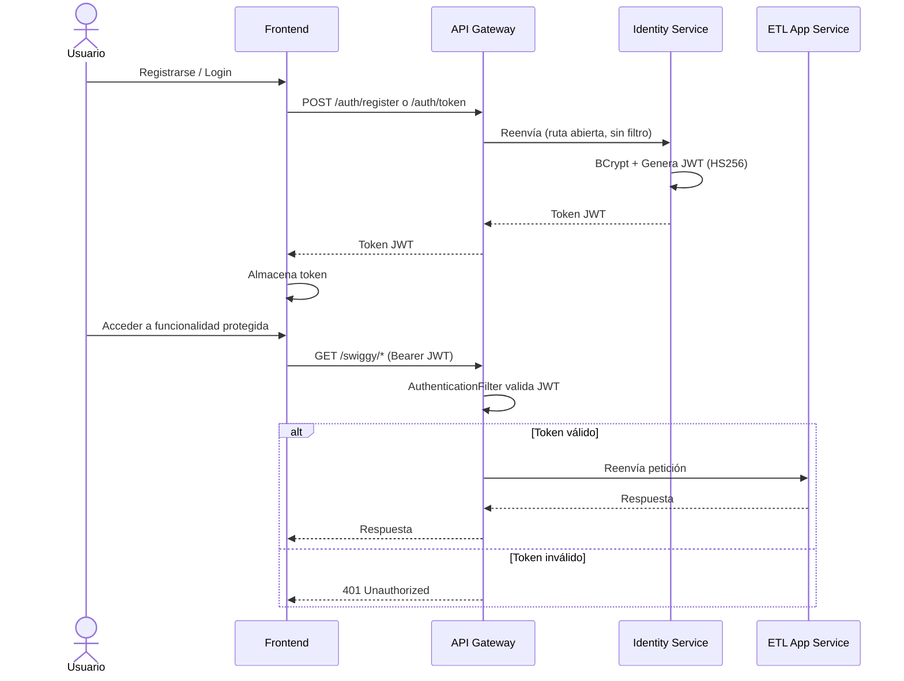
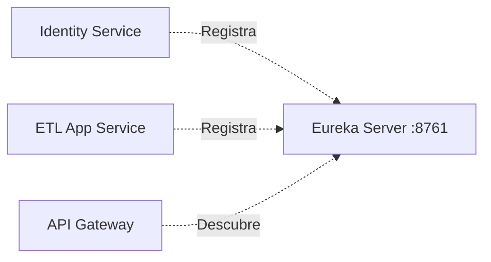
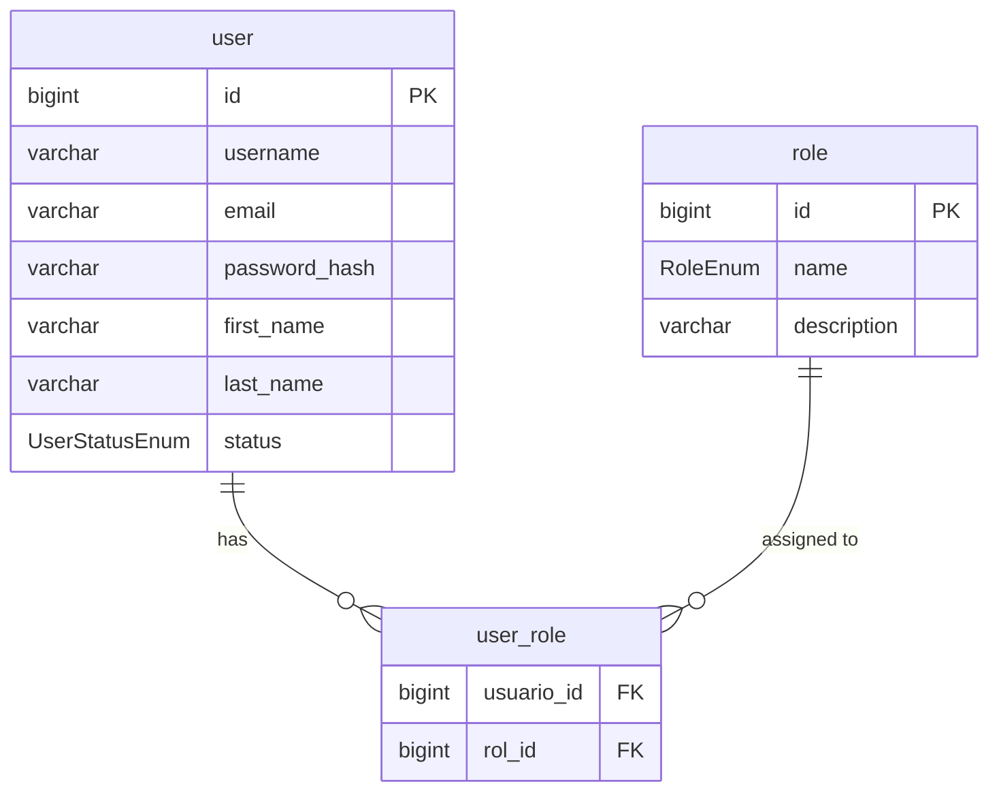
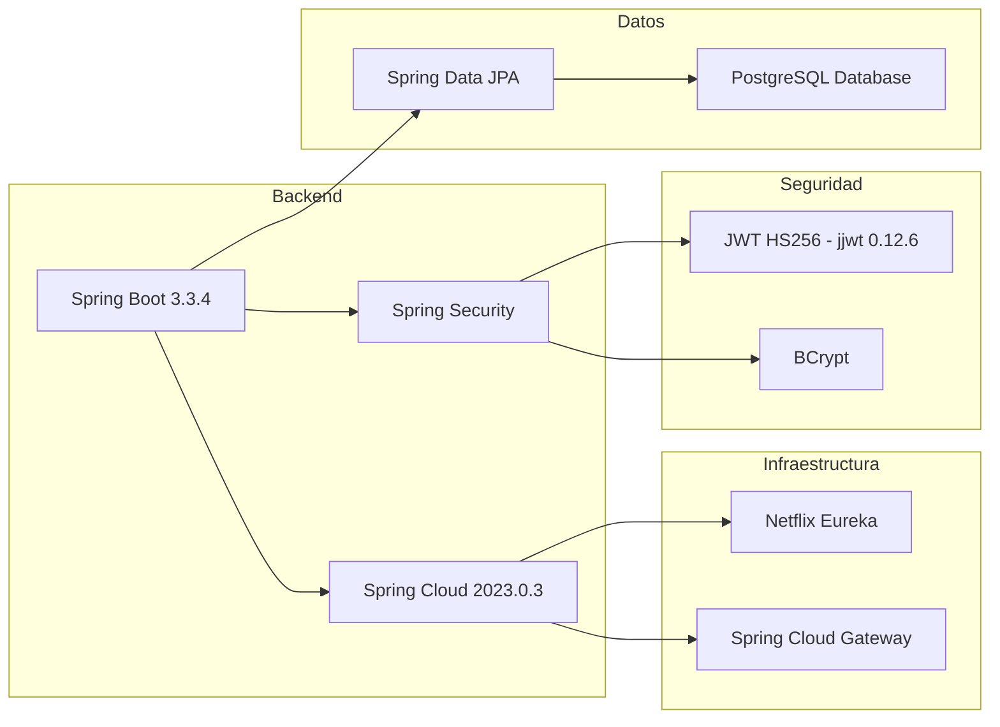
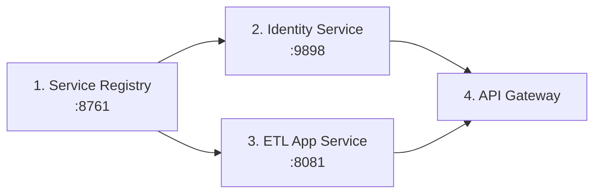
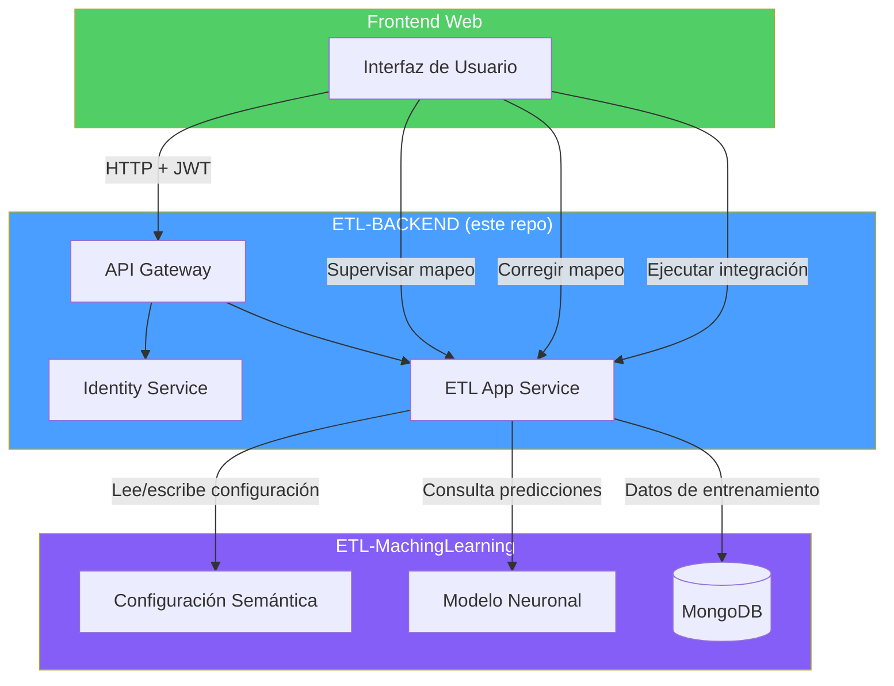

# ETL-BACKEND

Backend de microservicios para la plataforma web **ETL-MachingLearning**. Proporciona la infraestructura necesaria para que los usuarios puedan configurar APIs, supervisar el mapeo de campos generado por el modelo de Machine Learning, realizar correcciones manuales y ejecutar integraciones ETL entre sistemas empresariales como **NetSuite** y **Oracle Primavera Unifier**.

---

## Tabla de Contenidos

- [Descripción General](#descripción-general)
- [Arquitectura de Microservicios](#arquitectura-de-microservicios)
- [Flujo de Autenticación](#flujo-de-autenticación)
- [Detalle de Microservicios](#detalle-de-microservicios)
- [Tecnologías](#tecnologías)
- [Requisitos Previos](#requisitos-previos)
- [Instalación y Ejecución](#instalación-y-ejecución)
- [Endpoints de la API](#endpoints-de-la-api)
- [Relación con ETL-MachingLearning](#relación-con-etl-machinglearning)
- [Contribuir](#contribuir)

---

## Descripción General

Este repositorio contiene el backend de la plataforma ETL, construido con una arquitectura de microservicios usando **Spring Boot** y **Spring Cloud**. Su objetivo es servir como la capa web que permite a los usuarios:

- **Configurar APIs** de origen y destino para procesos ETL.
- **Supervisar el mapeo** de campos generado automáticamente por el módulo de Machine Learning.
- **Corregir manualmente** las equivalencias de campos cuando sea necesario.
- **Ejecutar integraciones** entre los sistemas conectados.

---

## Arquitectura de Microservicios



---

## Flujo de Autenticación



---

## Detalle de Microservicios

### 1. Service Registry (Eureka Server)

| Propiedad     | Valor                              |
|---------------|------------------------------------|
| **Puerto**    | 8761                               |
| **Tecnología**| Netflix Eureka Server              |
| **Función**   | Descubrimiento de servicios        |



No se registra a sí mismo (`register-with-eureka: false`, `fetch-registry: false`).

### 2. API Gateway (Spring Cloud Gateway)

| Propiedad     | Valor                                  |
|---------------|----------------------------------------|
| **Tecnología**| Spring Cloud Gateway (WebFlux)         |
| **Función**   | Punto de entrada único, routing y auth |

**Rutas configuradas:**

| Ruta              | Servicio Destino           | Autenticación              |
|-------------------|----------------------------|----------------------------|
| `/auth/**`        | IDENTITY-SERVICE (lb)      | No (ruta abierta)          |
| `/swiggy/**`      | SWIGGY-APP (lb)            | Sí (AuthenticationFilter)  |

**Rutas abiertas (sin autenticación):** `/auth/register`, `/auth/token`, `/eureka`

### 3. Identity Service (Autenticación)

| Propiedad        | Valor                                |
|------------------|--------------------------------------|
| **Puerto**       | 9898                                 |
| **Función**      | Registro, login, generación de JWT   |
| **Base de datos**| PostgreSQL                           |
| **Seguridad**    | Spring Security + BCrypt + JWT HS256 |



### 4. ETL App Service (Lógica de Negocio)

| Propiedad     | Valor                                              |
|---------------|-----------------------------------------------------|
| **Puerto**    | 8081                                                |
| **Función**   | Lógica de negocio, configuración de APIs, mapeo ETL |
| **Comunicación**| RestTemplate con `@LoadBalanced`                  |

Este servicio es el núcleo funcional que se conecta con el módulo de **ETL-MachingLearning** para:
- Obtener predicciones de mapeo del modelo ML.
- Permitir supervisión y corrección de mapeos.
- Ejecutar las integraciones ETL configuradas.

---

## Tecnologías



| Componente              | Tecnología                              |
|-------------------------|-----------------------------------------|
| Lenguaje                | Java 21                                 |
| Framework               | Spring Boot 3.3.4                       |
| Cloud                   | Spring Cloud 2023.0.3                   |
| Gateway                 | Spring Cloud Gateway (WebFlux)          |
| Service Discovery       | Netflix Eureka                          |
| Seguridad               | Spring Security + JWT (HS256)           |
| Base de Datos           | PostgreSQL                              |
| ORM                     | Spring Data JPA                         |
| Build                   | Maven                                   |
| Utilidades              | Lombok                                  |

---

## Requisitos Previos

- **Java** 21 o superior
- **Maven** 3.9+ (o usar el wrapper `mvnw` incluido)

---

## Instalación y Ejecución

### 1. Clonar el repositorio

```bash
git clone https://github.com/ByAncort/ETL-BACKEND.git
cd ETL-BACKEND
```

### 2. Orden de inicio de los servicios

Los servicios deben iniciarse en el siguiente orden:



```bash
# 1. Service Registry (Eureka)
cd swiggy-service-registry
./mvnw spring-boot:run

# 2. Identity Service
cd identity-service
./mvnw spring-boot:run

# 3. ETL App Service
cd swiggy-app
./mvnw spring-boot:run

# 4. API Gateway
cd swiggy-gateway
./mvnw spring-boot:run
```

### 3. Verificar que los servicios están registrados

Accede al dashboard de Eureka: [http://localhost:8761](http://localhost:8761)

---

## Endpoints de la API

Todas las peticiones pasan por el **API Gateway**.

### Autenticación (rutas abiertas)

| Método | Ruta               | Body                                                    | Descripción              |
|--------|--------------------|---------------------------------------------------------|--------------------------|
| POST   | `/auth/register`   | `{"name":"...", "email":"...", "password":"..."}`        | Registrar nuevo usuario  |
| POST   | `/auth/token`      | `{"username":"...", "password":"..."}`                   | Obtener token JWT (login)|
| GET    | `/auth/validate`   | `?token=<jwt>`                                           | Validar token JWT        |

### Servicio de Negocio (requiere Bearer JWT)

| Método | Ruta             | Header                          | Descripción                    |
|--------|------------------|---------------------------------|--------------------------------|
| GET    | `/swiggy/home`   | `Authorization: Bearer <token>` | Mensaje de bienvenida          |

### Ejemplo de uso

```bash
# 1. Registrar usuario
curl -X POST http://localhost:8080/auth/register \
  -H "Content-Type: application/json" \
  -d '{"name":"admin", "email":"admin@etl.com", "password":"secret123"}'

# 2. Obtener token
TOKEN=$(curl -s -X POST http://localhost:8080/auth/token \
  -H "Content-Type: application/json" \
  -d '{"username":"admin", "password":"secret123"}')

# 3. Acceder a ruta protegida
curl http://localhost:8080/swiggy/home \
  -H "Authorization: Bearer $TOKEN"
```

---

## Relación con ETL-MachingLearning



Este backend es la capa de servicio que conecta el **frontend web** con el motor de **Machine Learning**:

- **Configuración de APIs:** Los usuarios configuran las APIs de origen/destino desde la interfaz web.
- **Supervisión de mapeo:** El modelo ML genera predicciones de equivalencia de campos, que los usuarios pueden revisar.
- **Correcciones manuales:** Si el modelo falla en algún mapeo, los usuarios pueden corregirlo directamente.
- **Ejecución de integraciones:** Una vez validado el mapeo, los usuarios pueden ejecutar el proceso ETL completo.

---

## Contribuir

1. Haz un fork del repositorio.
2. Crea una rama para tu feature: `git checkout -b feature/nueva-funcionalidad`
3. Realiza tus cambios y haz commit: `git commit -m "Agregar nueva funcionalidad"`
4. Sube tu rama: `git push origin feature/nueva-funcionalidad`
5. Abre un Pull Request.
